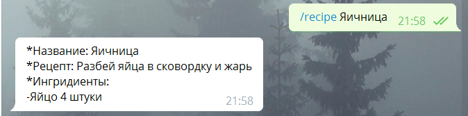

# CookBot
## Описание
  Бот - кулинарная книга для Telegram
## Авторы
   Ишин Данил, Гладышева Татьяна, Немцев Евгений
## План презентации
### Суть проекта
Данный бот позволяет по некоторым критериям получить рецепт. В данный момент поддерживаются следующие команды:
* /recipeName - найти рецепт по названию.
* /recipeIngr - получить список рецептов, в которых содержится указанный ингридиент.
* /recipeList - отобразить список всех рецептов.
* /help - информация о поддерживаемых командах.

#### Пример использования команды:

